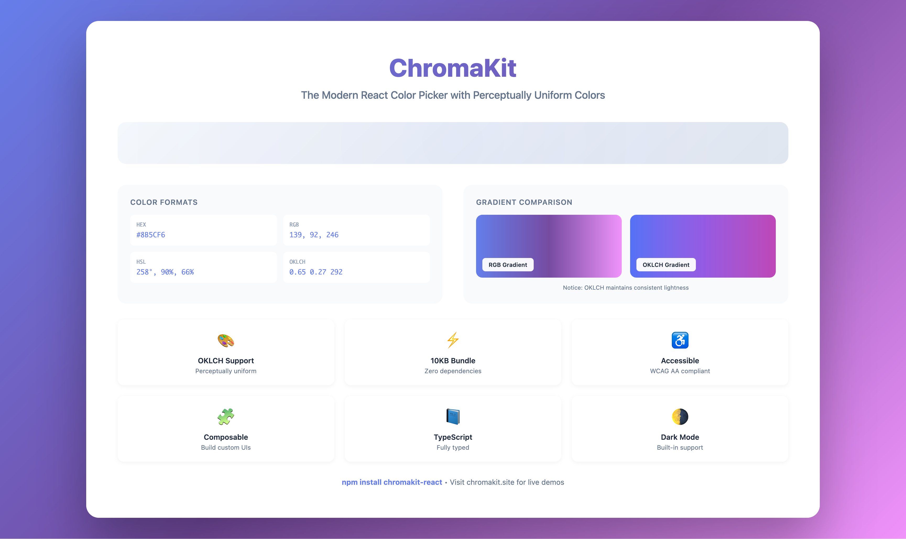

<div align="center">

# ChromaKit

### The Modern React Color Picker with Perceptually Uniform Colors

**Build better design systems with OKLCH color space support**

[](https://www.npmjs.com/package/chromakit-react)
[](https://www.npmjs.com/package/chromakit-react)
[](https://bundlephobia.com/package/chromakit-react)
[](https://github.com/garrettsiegel/chromakit/blob/main/LICENSE)
[](https://www.typescriptlang.org/)

[**🎨 Live Demo**](https://www.chromakit.site) • [**📚 Documentation**](https://www.chromakit.site) • [**🔄 Migration Guide**](./MIGRATION.md)

---

```bash
npm install chromakit-react
```

<br />

**[👉 See it in action →](https://www.chromakit.site)**

<br />



</div>

<br />

## ✨ Why Developers Choose ChromaKit

**The only React color picker built for modern design systems.** While other pickers struggle with consistent color scales and muddy gradients, ChromaKit uses perceptually uniform color spaces (OKLCH, OKLAB) to deliver what designers expect and users see.

```tsx
// Get started in 30 seconds
import { ColorPicker } from 'chromakit-react';
import 'chromakit-react/chromakit.css';

<ColorPicker onChange={(color) => console.log(color.oklch)} />;
```

### 🎯 Perfect For

- **Design System Engineers** - Generate consistent tonal scales with predictable lightness
- **Accessibility Teams** - Built-in WCAG AA/AAA contrast checking
- **App Developers** - Zero dependencies, 10KB bundle, works everywhere
- **UI Libraries** - Composable primitives, full TypeScript support

## 💎 What Makes ChromaKit Different

### 🎨 Perceptually Uniform Colors

**The Problem:** Traditional RGB/HSL create inconsistent color scales. A 10% lightness change in blue looks different than in yellow. Your carefully crafted design system falls apart.

**ChromaKit's Solution:** OKLCH color space ensures equal numerical changes produce equal visual differences. Generate accessible color palettes that _actually look_ evenly spaced.

```tsx
// Generate a perfectly uniform color scale
const scale = Array.from({ length: 9 }, (_, i) => {
  const lightness = 0.2 + i * 0.1; // 20% to 100%
  return `oklch(${lightness} 0.15 250)`; // Consistently spaced blues
});
```

### 🧩 Composable Architecture

Unlike monolithic pickers, ChromaKit gives you building blocks:

```tsx
import {
  ColorArea,
  HueSlider,
  AlphaSlider,
  useColorState,
} from 'chromakit-react';

// Build your perfect picker layout
function CustomPicker() {
  const { hsva, colorValue, updateColor } = useColorState('#6366F1');
  return (
    <>
      <ColorArea hsva={hsva} onChange={updateColor} />
      <HueSlider hsva={hsva} onChange={updateColor} />
      <AlphaSlider hsva={hsva} onChange={updateColor} />
    </>
  );
}
```

### ⚡ Built for Performance

- **10KB gzipped** - Competitive with alternatives, but includes OKLCH + composability
- **Zero dependencies** - No supply chain risk, no version conflicts
- **Tree-shakeable** - Import only what you use
- **60fps interactions** - Smooth dragging on all devices

### ♿ Accessibility Baked In

- **WCAG AA compliant** - Full keyboard navigation, proper ARIA labels
- **Contrast checker included** - `getContrastRatio()`, `meetsContrastRatio()`
- **Screen reader tested** - Works with NVDA, JAWS, VoiceOver
- **Touch-friendly** - 44px minimum touch targets

### 📘 TypeScript Excellence

Every color format, every component prop, every utility function - fully typed:

```tsx
import type { ColorValue, OKLCHColor, RGBColor } from 'chromakit-react';

const handleChange = (value: ColorValue) => {
  value.oklch; // { l: number, c: number, h: number }
  value.rgb; // { r: number, g: number, b: number }
  value.hex; // string
};
```

### Comparison

| Feature        | ChromaKit   | react-colorful | react-color |
| -------------- | ----------- | -------------- | ----------- |
| Bundle Size    | ~10KB       | ~3KB           | ~28KB       |
| OKLCH/OKLAB    | ✅          | ❌             | ❌          |
| Tree-shakeable | ✅          | ✅             | ❌          |
| TypeScript     | ✅ Native   | ✅             | ⚠️ @types   |
| Composable     | ✅          | Limited        | ❌          |
| Dark Mode      | ✅ Built-in | Manual         | Manual      |
| Dependencies   | 0           | 0              | Many        |

### 🤔 When to Choose ChromaKit

**✅ Use ChromaKit if you:**

- Need consistent color scales for design systems
- Want OKLCH/OKLAB support for wide-gamut displays
- Require accessibility features (WCAG checking)
- Prefer composable components over all-in-one solutions
- Value TypeScript-first development

**⚠️ Use react-colorful if:**

- Bundle size is your #1 priority (need <5KB)
- Traditional RGB/HSL is sufficient
- Don't need advanced color space features

**🔄 Migrating?** See our [Migration Guide](./MIGRATION.md) for step-by-step instructions from react-colorful or react-color.

---

## 📦 Features

- **Modern Color Spaces**: OKLCH, OKLAB support for perceptually uniform colors
- **Traditional Formats**: RGB(A), HSL(A), HSV(A), HEX, HEX8
- **Composable**: Build custom pickers with primitive components
- **Eyedropper Tool**: Pick colors from anywhere on screen (modern browsers)
- **Color History**: Automatically saves recent colors to localStorage
- **Copy to Clipboard**: Quick color copying with keyboard shortcuts (Cmd/Ctrl+C)
- **Color Harmony**: Utilities for complementary, analogous, triadic color schemes
- **Contrast Checker**: WCAG AA/AAA contrast ratio calculator
- **TypeScript First**: Complete type definitions
- **Dark Mode**: Built-in dark mode support
- **Lightweight**: ~10KB gzipped with zero runtime dependencies
- **Accessible**: WCAG compliant (keyboard navigation, ARIA labels)

## 🚀 Quick Start

**Controlled Component** (recommended)

```tsx
import { useState } from 'react';
import { ColorPicker } from 'chromakit-react';
import 'chromakit-react/chromakit.css';

function App() {
  const [color, setColor] = useState('#6366F1');

  return (
    <ColorPicker
      value={color}
      onChange={(colorValue) => setColor(colorValue.hex)}
    />
  );
}
```

That's it! You now have a fully-featured color picker with OKLCH support, eyedropper, color history, and more.

> **💡 Pro Tip:** Use `presetGroups` to give users quick access to your brand colors or popular design system palettes (Material, Tailwind, Bootstrap).

## 🛠️ Framework Setup

### Next.js

**App Router (Next.js 13+)**

```tsx
// app/components/ColorPicker.tsx
'use client';

import { useState } from 'react';
import { ColorPicker } from 'chromakit-react';
import 'chromakit-react/chromakit.css';

export function MyColorPicker() {
  const [color, setColor] = useState('#6366F1');

  return (
    <ColorPicker
      value={color}
      onChange={(colorValue) => setColor(colorValue.hex)}
    />
  );
}
```

**Pages Router (Next.js 12)**

```tsx
// pages/index.tsx
import dynamic from 'next/dynamic';

const ColorPicker = dynamic(
  () => import('chromakit-react').then((mod) => mod.ColorPicker),
  { ssr: false }
);

export default function Page() {
  return <ColorPicker defaultValue="#6366F1" />;
}
```

Import CSS in `_app.tsx`:

```tsx
import 'chromakit-react/chromakit.css';
```

### Vite

```tsx
import { ColorPicker } from 'chromakit-react';
import 'chromakit-react/chromakit.css';

// Works out of the box - no configuration needed
```

### Create React App

```tsx
import { ColorPicker } from 'chromakit-react';
import 'chromakit-react/chromakit.css';

// Works out of the box
```

### CSS Import Options

ChromaKit styles can be imported in two ways:

**Option 1: Manual Import** (recommended)

```tsx
import 'chromakit-react/chromakit.css';
```

**Option 2: Automatic Import**

```tsx
import { ColorPicker } from 'chromakit-react';
// CSS is automatically included via side effects
```

For optimal bundle size with tree-shaking, configure your bundler:

```js
// vite.config.js
export default {
  build: {
    rollupOptions: {
      output: {
        manualChunks: {
          chromakit: ['chromakit-react'],
        },
      },
    },
  },
};
```

## API Reference

### ColorPicker

The main color picker component with all features included.

```tsx
interface ColorPickerProps {
  // Value control
  value?: string;
  defaultValue?: string;
  onChange?: (color: ColorValue) => void;
  onChangeComplete?: (color: ColorValue) => void;

  // UI configuration
  formats?: ColorFormat[];
  showAlpha?: boolean;
  showInputs?: boolean;
  showPreview?: boolean;
  showCopyButton?: boolean;
  showEyeDropper?: boolean;
  showPresets?: boolean;

  // Presets
  presets?: string[];
  presetGroups?: PresetGroup[] | Record<string, string[]>;

  // History
  enableHistory?: boolean;

  // Dimensions
  width?: number;
  height?: number;

  // Styling
  className?: string;
}
```

**Props:**

| Prop               | Type                                          | Default                          | Description                                         |
| ------------------ | --------------------------------------------- | -------------------------------- | --------------------------------------------------- |
| `value`            | `string`                                      | -                                | Controlled color value (any supported format)       |
| `defaultValue`     | `string`                                      | `'#6366F1'`                      | Initial color for uncontrolled mode                 |
| `onChange`         | `(color: ColorValue) => void`                 | -                                | Fires during color changes (real-time)              |
| `onChangeComplete` | `(color: ColorValue) => void`                 | -                                | Fires when user completes a change (mouse up, blur) |
| `formats`          | `ColorFormat[]`                               | `['hex', 'rgb', 'hsl', 'oklch']` | Available color format options                      |
| `showAlpha`        | `boolean`                                     | `true`                           | Enable alpha channel controlha channel control      |
| `showInputs`       | `boolean`                                     | `true`                           | Show color input fields                             |
| `showPreview`      | `boolean`                                     | `true`                           | Show color preview swatch                           |
| `showCopyButton`   | `boolean`                                     | `true`                           | Show copy button (enables Cmd/Ctrl+C)               |
| `showEyeDropper`   | `boolean`                                     | `true`                           | Show eyedropper button (if browser supports)        |
| `showPresets`      | `boolean`                                     | `true`                           | Show preset colors section                          |
| `presets`          | `string[]`                                    | Built-in defaults                | Custom preset colors array                          |
| `presetGroups`     | `PresetGroup[]` or `Record<string, string[]>` | Built-in groups                  | Preset color groups with dropdown                   |
| `enableHistory`    | `boolean`                                     | `true`                           | Store recent colors in localStorage                 |
| `width`            | `number`                                      | auto                             | Custom picker width in pixels                       |
| `height`           | `number`                                      | `100`                            | Color area height in pixels                         |
| `className`        | `string`                                      | -                                | Additional CSS classes                              |

**ColorValue Object:**

The `onChange` and `onChangeComplete` callbacks receive a `ColorValue` object:

```tsx
interface ColorValue {
  hex: string; // "#ff6b6b"
  hex8: string; // "#ff6b6bff"
  rgb: RGBColor; // { r: 255, g: 107, b: 107 }
  rgba: RGBAColor; // { r: 255, g: 107, b: 107, a: 1 }
  hsl: HSLColor; // { h: 0, s: 100, l: 71 }
  hsla: HSLAColor; // { h: 0, s: 100, l: 71, a: 1 }
  hsv: HSVColor; // { h: 0, s: 58, v: 100 }
  hsva: HSVAColor; // { h: 0, s: 58, v: 100, a: 1 }
  oklch: OKLCHColor; // { l: 0.71, c: 0.19, h: 25 }
  oklcha: OKLCHAColor; // { l: 0.71, c: 0.19, h: 25, a: 1 }
  oklab: OKLABColor; // { l: 0.71, a: 0.17, b: 0.08 }
  oklaba: OKLABAColor; // { l: 0.71, a: 0.17, b: 0.08, alpha: 1 }
}
```

### Composable Components

Build custom pickers using primitive components for complete layout control:

```tsx
import {
  ColorArea,
  HueSlider,
  AlphaSlider,
  ColorPreview,
  ColorInputs,
  useColorState,
} from 'chromakit-react';

function CustomPicker() {
  const { hsva, colorValue, updateColor } = useColorState('#ff0000');

  return (
    <div className="custom-picker">
      <ColorArea hsva={hsva} onChange={updateColor} width={200} height={150} />
      <HueSlider hsva={hsva} onChange={updateColor} />
      <AlphaSlider hsva={hsva} onChange={updateColor} />
      <ColorPreview colorValue={colorValue} size="lg" />
      <ColorInputs
        colorValue={colorValue}
        onChange={(hex) => updateColor(parseColor(hex))}
        format="hex"
      />
    </div>
  );
}
```

**Component Props:**

<details>
<summary><strong>ColorArea</strong> - 2D saturation/lightness picker</summary>

```tsx
interface ColorAreaProps {
  hsva: HSVAColor;
  onChange: (hsva: HSVAColor) => void;
  onStart?: () => void;
  onEnd?: () => void;
  width?: number; // Default: 256
  height?: number; // Default: 200
  className?: string;
}
```

</details>

<details>
<summary><strong>HueSlider</strong> - Hue selection slider</summary>

```tsx
interface HueSliderProps {
  hsva: HSVAColor;
  onChange: (hsva: HSVAColor) => void;
  onStart?: () => void;
  onEnd?: () => void;
  vertical?: boolean; // Default: false
  className?: string;
}
```

</details>

<details>
<summary><strong>AlphaSlider</strong> - Alpha/transparency slider</summary>

```tsx
interface AlphaSliderProps {
  hsva: HSVAColor;
  onChange: (hsva: HSVAColor) => void;
  onStart?: () => void;
  onEnd?: () => void;
  vertical?: boolean; // Default: false
  className?: string;
}
```

</details>

<details>
<summary><strong>ColorPreview</strong> - Color swatch with comparison</summary>

```tsx
interface ColorPreviewProps {
  colorValue: ColorValue;
  showComparison?: boolean; // Show before/after
  originalColor?: string; // Original color for comparison
  size?: 'sm' | 'md' | 'lg'; // Default: 'md'
  className?: string;
}
```

</details>

<details>
<summary><strong>ColorInputs</strong> - Format-switchable input fields</summary>

```tsx
interface ColorInputsProps {
  colorValue: ColorValue;
  onChange: (hexColor: string) => void;
  format: ColorFormat;
  onFormatChange?: (format: ColorFormat) => void;
  showAlpha?: boolean;
  availableFormats?: ColorFormat[];
  className?: string;
}
```

</details>

<details>
<summary><strong>ColorSwatch</strong> - Individual color button</summary>

```tsx
interface ColorSwatchProps {
  color: string;
  onClick?: () => void;
  active?: boolean;
  size?: 'sm' | 'md' | 'lg';
  className?: string;
}
```

</details>

<details>
<summary><strong>RecentColors</strong> - Color history display</summary>

```tsx
interface RecentColorsProps {
  onColorSelect?: (color: string) => void;
  maxColors?: number; // Default: 10
  className?: string;
}
```

</details>

### Hooks

**useColorState** - Main color state management hook

```tsx
function useColorState(initialColor?: string) {
  return {
    hsva: HSVAColor;           // Internal HSVA representation
    colorValue: ColorValue;     // All format conversions
    updateColor: (hsva: HSVAColor) => void;
    setColorFromString: (color: string) => void;
  };
}
```

**useDrag** - Drag interaction handler (for custom components)

```tsx
function useDrag(
  ref: RefObject<HTMLElement>,
  onDrag: (x: number, y: number) => void,
  onStart?: () => void,
  onEnd?: () => void
): void;
```

### Color Formats

ChromaKit supports the following color formats:

| Format | Example                   | Description                      |
| ------ | ------------------------- | -------------------------------- |
| HEX    | `#ff0000`                 | Hexadecimal RGB                  |
| HEX8   | `#ff0000ff`               | Hex with alpha                   |
| RGB    | `rgb(255, 0, 0)`          | Red, Green, Blue                 |
| RGBA   | `rgba(255, 0, 0, 1)`      | RGB with alpha                   |
| HSL    | `hsl(0, 100%, 50%)`       | Hue, Saturation, Lightness       |
| HSLA   | `hsla(0, 100%, 50%, 1)`   | HSL with alpha                   |
| HSV    | `hsv(0, 100%, 100%)`      | Hue, Saturation, Value           |
| HSVA   | `hsva(0, 100%, 100%, 1)`  | HSV with alpha                   |
| OKLCH  | `oklch(0.63 0.26 29)`     | Perceptually uniform cylindrical |
| OKLCHA | `oklch(0.63 0.26 29 / 1)` | OKLCH with alpha                 |
| OKLAB  | `oklab(0.63 0.22 0.13)`   | Perceptually uniform Cartesian   |

## Examples

### Basic Usage

**Simple controlled picker**

```tsx
const [color, setColor] = useState('#6366F1');

<ColorPicker
  value={color}
  onChange={(colorValue) => setColor(colorValue.hex)}
/>;
```

### Preset Colors

**Custom preset colors**

```tsx
<ColorPicker
  value={color}
  onChange={(colorValue) => setColor(colorValue.hex)}
  presets={['#FF6B6B', '#4ECDC4', '#45B7D1', '#FFA07A', '#98D8C8', '#F7DC6F']}
/>
```

**Preset groups with dropdown** (New in v0.1.10)

```tsx
const presetGroups = [
  {
    name: 'Material',
    colors: ['#F44336', '#E91E63', '#9C27B0', '#673AB7', '#3F51B5'],
  },
  {
    name: 'Tailwind',
    colors: ['#EF4444', '#F97316', '#EAB308', '#22C55E', '#10B981'],
  },
];

<ColorPicker
  value={color}
  onChange={(colorValue) => setColor(colorValue.hex)}
  presetGroups={presetGroups}
/>;
```

Or use object format:

```tsx
const presetGroups = {
  Material: ['#F44336', '#E91E63', '#9C27B0', '#673AB7', '#3F51B5'],
  Tailwind: ['#EF4444', '#F97316', '#EAB308', '#22C55E', '#10B981'],
};

<ColorPicker
  value={color}
  onChange={(colorValue) => setColor(colorValue.hex)}
  presetGroups={presetGroups}
/>;
```

### Format Control

**Limit available formats**

```tsx
<ColorPicker
  value={color}
  onChange={(colorValue) => setColor(colorValue.hex)}
  formats={['oklch', 'hex', 'rgb']}
/>
```

### Advanced Features

**Track color changes completion**

```tsx
<ColorPicker
  value={color}
  onChange={(colorValue) => {
    // Fires during dragging (real-time updates)
    setColor(colorValue.hex);
  }}
  onChangeComplete={(colorValue) => {
    // Fires when user finishes selecting (mouse up, blur)
    // Perfect for API calls or expensive operations
    saveColorToDatabase(colorValue.hex);
  }}
/>
```

**Color history with localStorage**

```tsx
<ColorPicker
  value={color}
  onChange={(colorValue) => setColor(colorValue.hex)}
  enableHistory={true} // Automatically saves recent colors
/>
```

**Access all color formats**

```tsx
<ColorPicker
  value={color}
  onChange={(colorValue) => {
    console.log(colorValue.hex); // "#ff6b6b"
    console.log(colorValue.rgb); // { r: 255, g: 107, b: 107 }
    console.log(colorValue.oklch); // { l: 0.71, c: 0.19, h: 25 }
    setColor(colorValue.hex);
  }}
/>
```

### Eyedropper & Copy Features

**Built-in eyedropper and copy buttons**

```tsx
<ColorPicker
  value={color}
  onChange={(colorValue) => setColor(colorValue.hex)}
  showEyeDropper={true} // Shows eyedropper button (if browser supports)
  showCopyButton={true} // Shows copy button + enables Cmd/Ctrl+C
/>
```

Note: The EyeDropper API requires a secure context (HTTPS) and is currently supported in Chrome/Edge 95+, not yet in Firefox or Safari.

## Color Utilities

### Conversion Functions

Convert between any color format:

```tsx
import {
  hexToRgb,
  rgbToHex,
  rgbToHsl,
  hslToRgb,
  rgbToOklch,
  oklchToRgb,
  parseColor,
  colorValueToString,
} from 'chromakit-react';

// Parse any format
const parsed = parseColor('#ff6b6b');
// Returns: { r: 255, g: 107, b: 107, a: 1 }

// Convert between formats
const rgb = hexToRgb('#ff0000'); // { r: 255, g: 0, b: 0 }
const hex = rgbToHex(rgb); // '#ff0000'
const hsl = rgbToHsl(rgb); // { h: 0, s: 100, l: 50 }
const oklch = rgbToOklch(rgb); // { l: 0.63, c: 0.26, h: 29 }

// Format color value to string
const color = { r: 255, g: 107, b: 107, a: 1 };
const hexString = colorValueToString(color, 'hex'); // "#ff6b6b"
const rgbString = colorValueToString(color, 'rgb'); // "rgb(255, 107, 107)"
const oklchString = colorValueToString(color, 'oklch'); // "oklch(0.71 0.19 25)"
```

**Available conversion functions:**

- `hexToRgba(hex)` - Parse hex to RGBA
- `parseColor(color)` - Parse any format to RGBA
- `rgbToHex(rgb)` - RGB to 6-digit hex
- `rgbaToHex8(rgba)` - RGBA to 8-digit hex
- `rgbToHsl(rgb)` / `hslToRgb(hsl)`
- `rgbaToHsla(rgba)` / `hslaToRgba(hsla)`
- `rgbToHsv(rgb)` / `hsvToRgb(hsv)`
- `rgbaToHsva(rgba)` / `hsvaToRgba(hsva)`
- `rgbToOklab(rgb)` / `oklabToRgb(oklab)`
- `rgbaToOklaba(rgba)` / `oklabaToRgba(oklaba)`
- `rgbToOklch(rgb)` / `oklchToRgb(oklch)`
- `rgbaToOklcha(rgba)` / `oklchaToRgba(oklcha)`
- `oklabToOklch(oklab)` / `oklchToOklab(oklch)`
- `rgbaToColorValue(rgba)` - Convert to all formats
- `colorValueToString(colorValue, format)` - Format to string

### Color Formats

ChromaKit supports the following color formats:

| Format | Example                   | Description                      |
| ------ | ------------------------- | -------------------------------- |
| HEX    | `#ff0000`                 | Hexadecimal RGB                  |
| HEX8   | `#ff0000ff`               | Hex with alpha                   |
| RGB    | `rgb(255, 0, 0)`          | Red, Green, Blue                 |
| RGBA   | `rgba(255, 0, 0, 1)`      | RGB with alpha                   |
| HSL    | `hsl(0, 100%, 50%)`       | Hue, Saturation, Lightness       |
| HSLA   | `hsla(0, 100%, 50%, 1)`   | HSL with alpha                   |
| HSV    | `hsv(0, 100%, 100%)`      | Hue, Saturation, Value           |
| HSVA   | `hsva(0, 100%, 100%, 1)`  | HSV with alpha                   |
| OKLCH  | `oklch(0.63 0.26 29)`     | Perceptually uniform cylindrical |
| OKLCHA | `oklch(0.63 0.26 29 / 1)` | OKLCH with alpha                 |
| OKLAB  | `oklab(0.63 0.22 0.13)`   | Perceptually uniform Cartesian   |

## Why OKLCH?

OKLCH (Oklab Lightness Chroma Hue) is a modern, perceptually uniform color space that provides significant advantages over traditional RGB and HSL:

### Benefits

- **Perceptually Uniform**: Equal numerical changes produce equal visual differences. A lightness change from 40% to 50% looks the same as 70% to 80%.

- **Predictable Lightness**: Unlike HSL where `hsl(240, 100%, 50%)` (blue) appears much darker than `hsl(60, 100%, 50%)` (yellow) despite having the same lightness value, OKLCH's lightness truly represents perceived brightness.

- **Better Gradients**: Transitions between colors avoid muddy middle tones. Compare an RGB gradient from blue to yellow (goes through gray) vs OKLCH (stays vibrant).

- **Wide Gamut**: Access to more vibrant colors on modern displays beyond sRGB limitations.

- **Human-Friendly Parameters**:
  - **L (Lightness)**: 0 (black) to 1 (white)
  - **C (Chroma)**: 0 (grayscale) to ~0.4 (vibrant)
  - **H (Hue)**: 0-360° around the color wheel

### Practical Applications

**Design Systems**: Generate consistent tonal scales where each step has uniform visual weight.

**Accessible Palettes**: Predictable lightness makes it easier to ensure WCAG contrast ratios.

**Color Manipulation**: Lighten/darken colors by adjusting L while maintaining hue perception.

### Example Comparison

```tsx
// HSL: Same lightness, different perceived brightness
hsl(240, 100%, 50%)  // Blue - looks dark
hsl(60, 100%, 50%)   // Yellow - looks bright

// OKLCH: Same lightness, same perceived brightness
oklch(0.5 0.2 240)   // Blue at 50% brightness
oklch(0.5 0.2 60)    // Yellow at 50% brightness - adjusted automatically
```

[Learn more about OKLCH →](https://oklch.com/)

## Browser Support

ChromaKit works in all modern browsers:

- **Chrome/Edge**: 88+
- **Firefox**: 87+
- **Safari**: 15+

### Feature Support

| Feature                  | Browser Support                         | Fallback                    |
| ------------------------ | --------------------------------------- | --------------------------- |
| Color Picker             | All modern browsers                     | -                           |
| OKLCH/OKLAB calculations | All modern browsers                     | -                           |
| CSS `oklch()` syntax     | Chrome 111+, Firefox 113+, Safari 15.4+ | Use hex/rgb output          |
| EyeDropper API           | Chrome/Edge 95+                         | Button hidden automatically |
| Clipboard API            | All modern browsers (HTTPS required)    | Manual copy                 |

For CSS OKLCH color space support, see [Can I Use: OKLCH](https://caniuse.com/mdn-css_types_color_oklch).

## Styling & Theming

ChromaKit uses CSS variables for theming, making it easy to customize colors for light and dark modes.

### CSS Variables

Override these variables in your CSS:

```css
:root {
  /* Background colors */
  --ck-bg-primary: #ffffff;
  --ck-bg-secondary: #f9fafb;

  /* Border colors */
  --ck-border: #e5e7eb;
  --ck-border-hover: #d1d5db;

  /* Text colors */
  --ck-text-primary: #111827;
  --ck-text-secondary: #6b7280;

  /* Interactive elements */
  --ck-accent: #6366f1;
  --ck-accent-hover: #4f46e5;
}

.dark {
  --ck-bg-primary: #1f2937;
  --ck-bg-secondary: #111827;
  --ck-border: #374151;
  --ck-border-hover: #4b5563;
  --ck-text-primary: #f9fafb;
  --ck-text-secondary: #9ca3af;
  --ck-accent: #818cf8;
  --ck-accent-hover: #6366f1;
}
```

### Custom Styling

Add custom classes to override specific styles:

```tsx
<ColorPicker
  className="my-custom-picker"
  value={color}
  onChange={(colorValue) => setColor(colorValue.hex)}
/>
```

```css
.my-custom-picker {
  border-radius: 16px;
  box-shadow: 0 10px 40px rgba(0, 0, 0, 0.1);
}

.my-custom-picker .ck-preview {
  border-radius: 8px;
}
```

## TypeScript

ChromaKit is written in TypeScript and provides complete type definitions for all exports.

### Type Exports

```tsx
import type {
  // Color format types
  RGBColor,
  RGBAColor,
  HSLColor,
  HSLAColor,
  HSVColor,
  HSVAColor,
  OKLCHColor,
  OKLCHAColor,
  OKLABColor,
  OKLABAColor,

  // Utility types
  ColorFormat,
  ColorValue,
  AnyColor,

  // Component props
  ColorPickerProps,
  ColorAreaProps,
  HueSliderProps,
  AlphaSliderProps,

  // Preset types
  PresetGroup,
  PresetGroupsInput,
} from 'chromakit-react';
```

### Type-Safe Color Conversions

```tsx
import {
  rgbToHsl,
  hslToRgb,
  type RGBColor,
  type HSLColor,
} from 'chromakit-react';

const rgb: RGBColor = { r: 255, g: 107, b: 107 };
const hsl: HSLColor = rgbToHsl(rgb);
// Type: { h: number; s: number; l: number }

const backToRgb: RGBColor = hslToRgb(hsl);
// Fully typed with autocomplete
```

## Troubleshooting

### Common Issues

**Issue: Styles not loading**

Make sure to import the CSS file:

```tsx
import 'chromakit-react/chromakit.css';
```

Or if using automatic imports, ensure your bundler processes CSS side effects.

---

**Issue: Eyedropper not showing**

The EyeDropper API requires:

- Secure context (HTTPS in production, localhost in development)
- Browser support (Chrome/Edge 95+)
- User permission

Check browser support:

```tsx
if ('EyeDropper' in window) {
  // Eyedropper available
}
```

---

**Issue: TypeScript errors with color formats**

Ensure you're using the correct types:

```tsx
import type { ColorValue } from 'chromakit-react';

const handleChange = (colorValue: ColorValue) => {
  // colorValue has all format properties
  console.log(colorValue.hex);
  console.log(colorValue.oklch);
};
```

---

**Issue: Next.js "window is not defined" error**

For server-side rendering, use dynamic imports:

```tsx
import dynamic from 'next/dynamic';

const ColorPicker = dynamic(
  () => import('chromakit-react').then((mod) => mod.ColorPicker),
  { ssr: false }
);
```

---

**Issue: Color history not persisting**

History uses localStorage with key `chromakit-color-history`. Ensure:

- localStorage is available (not in incognito/private mode)
- `enableHistory` prop is `true` (default)
- Browser has storage permissions

Clear history manually:

```tsx
import { clearColorHistory } from 'chromakit-react';
clearColorHistory();
```

---

\*\*I📚 Documentation & Resources

- 📖 [Migration Guide](./MIGRATION.md) - Switch from react-colorful or react-color
- ⚡ [Performance Benchmarks](./PERFORMANCE.md) - Bundle size and speed comparisons
- 🤝 [Contributing Guide](./CONTRIBUTING.md) - Help improve ChromaKit
- 📝 [Changelog](./CHANGELOG.md) - Version history and release notes
- 🎓 [OKLCH Explained](https://oklch.com/) - Learn about perceptually uniform colors

## 🌟 Community & Support

- **Issues?** [Open an issue](https://github.com/garrettsiegel/chromakit/issues) on GitHub
- **Questions?** Check existing [discussions](https://github.com/garrettsiegel/chromakit/discussions)
- **Updates?** Star the repo to get notified of new releases
- **Share?** Tweet [@garrettsiegel](https://twitter.com/garrettsiegel) with your projects!

## 🤝

// Or use composable components (smaller bundle)
import { ColorArea, HueSlider } from 'chromakit-react';

```

## Documentation

- 📖 [Migration Guide](./MIGRATION.md) - Migrating from react-colorful or react-color
- ⚡ [Performance Benchmarks](./PERFORMANCE.md) - Bundle size and speed comparisons
- 🤝 [Contributing Guide](./CONTRIBUTING.md) - How to contribute to ChromaKit
- 📝 [Changelog](./CHANGELOG.md) - Version history and release notes

## Contributing
💖 Support ChromaKit

If ChromaKit saves you time or helps build better products, consider:

- ⭐ **Star the repo** - Helps others discover ChromaKit
- 💬 **Share your project** - Tweet it, blog it, showcase it
- 🐛 **Report bugs** - Help improve quality for everyone
- 💰 **Sponsor development** - Keep it maintained and growing

[](https://github.com/sponsors/garrettsiegel)

**Used by:** If you're using ChromaKit in production, [let us know](https://github.com/garrettsiegel/chromakit/discussions)! We'd love to feature your project

## Support the Project

If ChromaKit has helped you build something awesome, consider supporting its development:

[](https://github.com/sponsors/garrettsiegel)

Your support helps maintain the project, add new features, and keep documentation up-to-date.

## License

MIT © [Garrett Siegel](https://github.com/garrettsiegel)

## Credits

**Built with:**
- [React](https://react.dev/) - UI framework
- [TypeScript](https://www.typescriptlang.org/) - Type safety
- [Vite](https://vitejs.dev/) - Build tool
### 🎨 [chromakit.site](https://www.chromakit.site)

Made with ❤️ by [Garrett Siegel](https://github.com/garrettsiegel)

**[Star on GitHub](https://github.com/garrettsiegel/chromakit)** • **[Try Live Demo](https://www.chromakit.site)** • **[Report Bug](https://github.com/garrettsiegel/chromakit/issues)**
**Color science based on:**
- [OKLCH specification](https://www.w3.org/TR/css-color-4/#ok-lab) - W3C standard
- [Oklab color space](https://bottosson.github.io/posts/oklab/) - Björn Ottosson's research

**Design inspired by:**
- [Radix UI](https://www.radix-ui.com/) - Component patterns
- [Tailwind CSS](https://tailwindcss.com/) - Color palettes

---

<div align="center">

**[chromakit.site](https://www.chromakit.site)** • Made with ❤️ by [Garrett Siegel](https://github.com/garrettsiegel)

</div>
```
